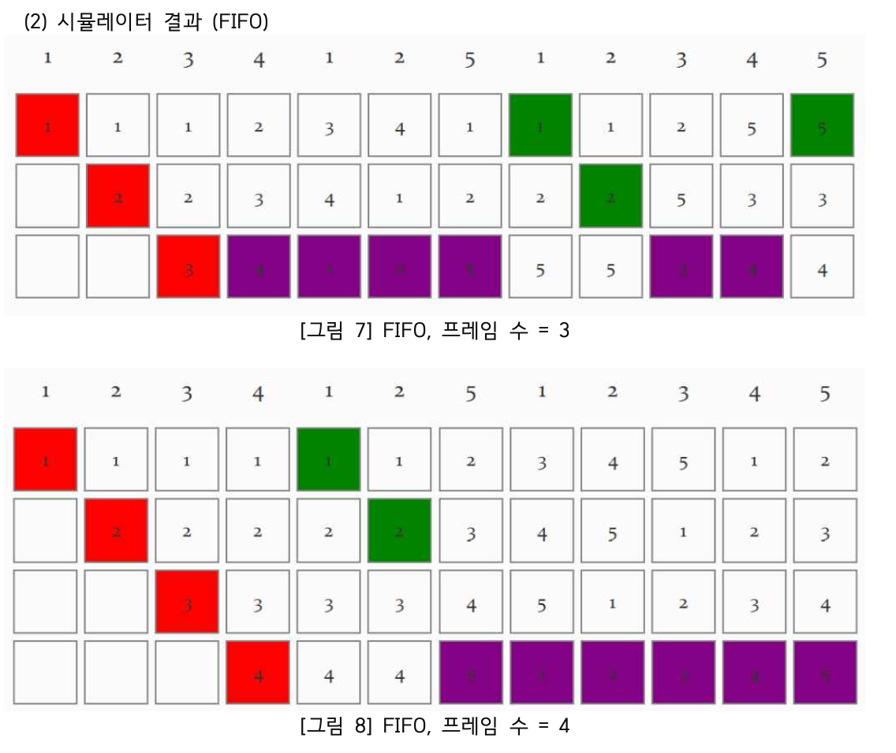

# Page Replacement Simulator

Java 기반으로 구현한 운영체제의 페이지 교체 알고리즘 시뮬레이터입니다.  
FIFO, LRU, OPT, Clock, LPR 알고리즘의 동작을 시각화하고 성능을 비교할 수 있습니다.

---

## 🖼️ 시뮬레이션 결과 미리보기

<p align="center">
  
  <br/><i>FIFO 알고리즘 실행 예시</i>
</p>

---

## 📌 프로젝트 개요

- 운영체제 수업에서 다룬 **가상 메모리 구조 및 페이지 교체 정책**에 대한 이론을 바탕으로, 직접 알고리즘을 구현하고 GUI 기반 시뮬레이터를 제작하였습니다.

- 사용자 입력 기반으로 페이지 참조 문자열과 프레임 수를 받아 시뮬레이션을 수행하며, Hit / Page Fault / 교체 여부를 **색상**으로 시각화하고, **통계 분석**까지 제공합니다.

- 기존 알고리즘 외에도 **LPR(Lowest Probability Replacement)** 라는 새로운 알고리즘을 제안하여 비교 분석했습니다.

---

## 🎯 주요 기능

- ✅ **5가지 알고리즘 지원**

  - FIFO (First-In-First-Out)
  - LRU (Least Recently Used)
  - Clock (Second Chance)
  - Optimal (Theoretical Upper Bound)
  - LPR (사용자 정의 예측 기반 알고리즘)

- 📊 **실시간 시각화 기능**

  - Hit: 초록색
  - Page Fault: 빨간색
  - 교체된 페이지: 보라색
  - 결과는 **원형 차트, Hit/Fault 카운트, 비율 통계**로 제공

- 🧪 **랜덤 참조 문자열 생성기 탑재**
  - 실험의 공정성을 위한 Reference Generator (길이 6~24, 알파벳 A~Z)

---

## 💻 실행 방법

### 1. Java 환경 설정

- JDK 11 이상 설치 필요
- JavaFX 17 이상 필요

### 2. 프로젝트 실행

```bash
# 프로젝트 루트에서 실행
javac -cp . --module-path /path/to/javafx-sdk/lib --add-modules javafx.controls *.java
java -cp . --module-path /path/to/javafx-sdk/lib --add-modules javafx.controls Main
```

※ `--module-path`에 JavaFX SDK 경로를 정확히 설정해 주세요.

### 3. 시뮬레이션 방법

- 참조 문자열과 프레임 수를 입력
- 알고리즘 선택 후 실행 버튼 클릭
- 실시간 메모리 상태, 통계, 차트 확인 가능

---

## 🛠 사용 기술

- Java 11
- JavaFX (GUI 구현)

---

## 📚 참고 자료

- 운영체제: [Modern Operating Systems, Andrew S. Tanenbaum]
- 페이지 교체 알고리즘 강의자료 및 실습
- 내부 구현 및 예측 알고리즘은 자체 설계한 **LPR** 방식 적용

---

## 👨‍💻 Contributors

- 김민재
- 박대형
